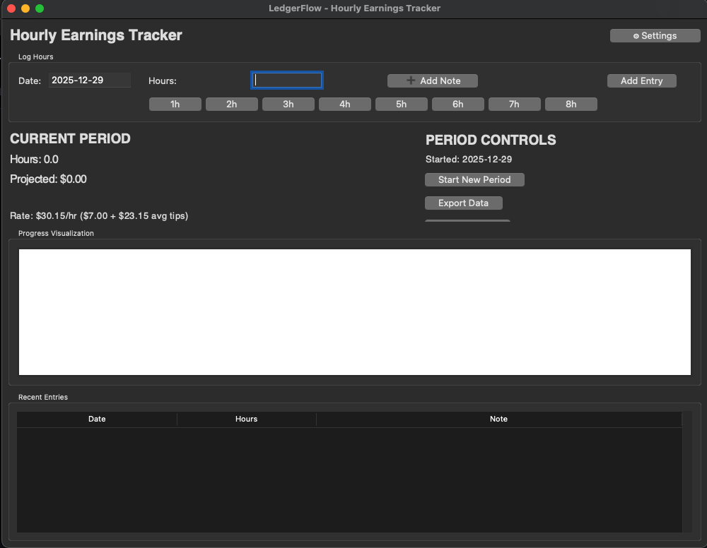

<div align="center">
  
</div>

# Hourly Rate Flow

A lightweight, local-first desktop application for tracking hourly work, pay periods, and projected earnings. Designed for hourly workers who want clarity and visibility without external services or cloud dependencies.

This project demonstrates clean desktop application structure, persistent local storage, and user-focused tooling.


---

## Features

- **Configurable Pay Model**
  - Base hourly rate
  - Optional average tips per hour
  - Clear separation between guaranteed pay and projections

- **Pay Period Management**
  - Track work across custom periods (weekly, bi-weekly, monthly, etc.)
  - Manually start new periods when needed

- **Visual Earnings Projection**
  - Simple visual representation of projected earnings
  - Emphasizes progress and transparency over precision guarantees

- **Fast Hour Entry**
  - Preset buttons for common hour values (1h–8h)
  - Keyboard-friendly workflow

- **Notes Per Entry**
  - Optional notes for context (shift details, events, adjustments)

- **Local Persistence**
  - SQLite database for entries and periods
  - JSON-based settings file
  - No network usage, no accounts, no external services

- **Data Export**
  - Export logged data to a text file for personal records

---

## Installation

### Prerequisites
- Python 3.8 or higher
- Tkinter (included with most standard Python distributions)

### Quick Start

```bash
git clone https://github.com/Luvvydev/hourly-rate-flow.git
cd hourly-rate-flow
python hourstrack.py
